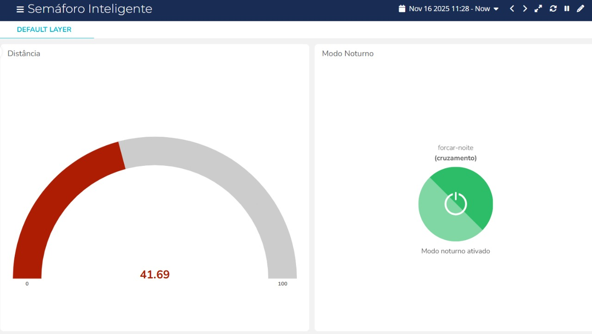

# Semáforo Inteligente com Arduino e Integração em IoT

## 1. Introdução

O presente projeto tem como objetivo o desenvolvimento de um **sistema de semáforo inteligente**, capaz de operar automaticamente em **modo diurno e noturno**, detectando a presença de veículos por meio de um **sensor ultrassônico (HC-SR04)** e realizando o envio e recebimento de dados por **IoT (Ubidots)**.

### **1.1 Missão de cada um**

Integrantes: Ana Jardim, Cauã, Celso, Débora, Eduarda, Eduardo, Patrick.

Observação: Todos os integrantes do grupo tiveram participações em todas as etapas do projeto, porém os destaques em que cada um ajudou mais foram os seguintes:

**Celso e Eduardo:** Montagem do código do projeto;  
**Ana, Patrick e Eduarda:** Documentação do projeto;  
**Cauã e Débora:** Montagem do protótipo físico.

➡️ Passagem da documentação para o Github: @celsick

## 2. Objetivos

### **2.1 Objetivo Geral**

Implementar um semáforo inteligente utilizando **Arduino/ESP32**, integrando sensores, lógica reativa e controle remoto via dashboard IoT.

### **2.2 Objetivos Específicos**

- Detectar a aproximação de veículos utilizando um sensor ultrassônico.
- Alterar o comportamento dos semáforos entre **modo diurno** e **modo noturno** automaticamente ou remotamente.
- Enviar dados de leitura para plataforma IoT.
- Criar uma **interface online** capaz de controlar o sistema remotamente.
- Registrar visualmente o funcionamento físico da montagem.

---

## 3. Materiais Utilizados

| Quantidade | Componente                             |
| ---------- | -------------------------------------- |
| 1x         | ESP32                                  |
| 4x         | Mini semáforos com LEDs (3 cores cada) |
| 1x         | Sensor Ultrassônico HC-SR04            |
| 1x         | Protoboard                             |
| Vários     | Jumpers macho–macho / macho–fêmea      |

---

## 4. Arquitetura do Sistema

O sistema foi desenvolvido com base em três pilares:

1. **Leitura de dados** através do sensor ultrassônico.
2. **Processamento lógico autônomo** no microcontrolador ESP32.
3. **Monitoramento e controle remoto** via plataforma Ubidots.

---

## 5. Circuito e Montagem Física

A montagem consiste em **quatro semáforos simulados** posicionados em cruzamento, controlados via pinos digitais.  
O sensor ultrassônico é instalado voltado para a pista, detectando objetos próximos e ativando o modo noturno caso a distância seja menor que o limite estabelecido.

> O **modo noturno** faz com que todos os semáforos pisquem **amarelo** simultaneamente, como ocorre no trânsito real quando o fluxo de veículos é baixo.

---

## 6. Plataforma IoT (Ubidots)

Foi criada uma **dashboard** com os seguintes itens:

- **Monitoramento de distância (cm)** em tempo real
- **Botão interruptor** para forçar o modo noturno remotamente

---

### Figura – Dashboard do Sistema

  FIGURA 1 – Dashboard de monitoramento e controle 
   
  Fonte: Material produzido pelos autores, 2025.

---

## 7. Funcionamento Lógico

### **Modo Diurno**

- Ciclos completos de semáforo obedecem sequência padrão:
  - Verde → Amarelo → Vermelho
  - Temporizações configuradas com timers não bloqueantes
- Semáforos se alternam entre grupos A e B

### **Modo Noturno**

- Ativado automaticamente se detectar objeto próximo **ou** via dashboard
- Todos os LEDs verdes e vermelhos se apagam
- Todos os LEDs amarelos piscam

## 8. Vídeo demonstrativo

➡️ [Clique aqui!](https://drive.google.com/drive/folders/1FFpTeUydURDezcFpfrrej9qZGtqf4Fp2?usp=sharing)